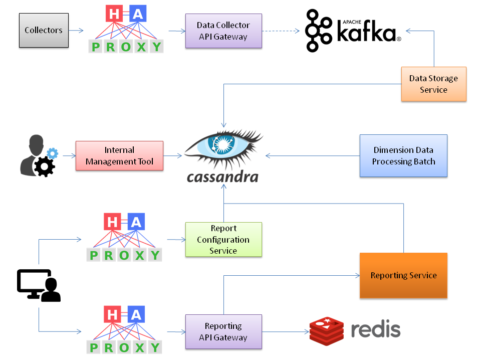

# Google Analytics Backend System Design

Design A Google Analytic like Backend System. We need to provide Google Analytic like services to our customers. Provide a high level solution design for the backend system. Feel free to choose any open source tools as you want.

The system needs to:

- Handle large write volume: Billions write events per day.

- Handle large read/query volume: Millions merchants want to get insight about their business. Read/Query patterns are time-series related metrics.

- Provide metrics to customers with at most one hour delay.

- Run with minimum downtime.

- Have the ability to reprocess historical data in case of bugs in the processing logic.

# Requirements Analysis

## Functional Requirements

> handle large read/query volume: Millions merchants want to get insight about their business. Read/Query patterns are time-series related metrics.


> provide metrics to customers with at most one hour delay.

> have the ability to reprocess historical data in case of bugs in the processing logic.

## Non-Functional Requirements

> handle large write volume: Billions write events per day.

> run with minimum downtime.

# High-Level Solution Design

## Domain Data Assumption

Report metrics may have various values of specified time interval of data points.

For simplicity, we assume that our system is required to provide report of `user purchase event` and `the sum of sales` of requested time interval.

## System Interfaces

The input of the system is time-series user event data points.

```java
class EventData {
    // The key used to identify user of a site.
    String userKey;
    // The sales of this purchase event.
    long sales;
}

class EventDataPoint {
    // The id used to identify site that produced the event data.
    String siteId;
    // The timestamp of event data.
    long timestamp;
    // The event data.
    EventData eventData;
}
```

The output of the system is time-series user event data points and aggregation result.

```java
class ReportData {
    // Event data count.
    long count;
    // Sum of sales.
    long sales;
}

class ReportDataPoint {
    // The unit type of spcified time interval queried. e.g., munite, hour, etc.
    TimeUnit timeUnit;
    // The offset of corresponding time unit type in storage. e.g., the 435336 hour since epoch.
    long offset;
    // The report data contains aggregated metrics of the current time internal unit. e.g., sum of events of 1 hour, etc.
    ReportData data;
}

class Report {
    // The id used to identify site that produced the event data.
    String siteId;
    // Report data points.
    List<ReportDataPoint> reportDataPoints;
    // The total count of events in specified time interval.
    long totalCount;
    // The total amount of sales in specified time interval.
    long totalSales;
}
```

Finally, the interfaces of the system is:

```java
// System input interface
interface EventDataCollector {
    void collect(EventDataPoint dataPoint);
}

// System output interface
interface ReportQueryExecutor {
    Report query(String siteId, TimeUnit timeUnit, long fromInclusive, long toInclusive);
}
```

## Storage, Sharding and Bucket

We have defined our domain data and system interfaces. The next step is to define storage model and indexes for query operations.

With respect to the requirements, we define storage as following:

### Backup Storage For Raw `EventDataPoint`

A backup storage for all raw `EventDataPoint` with which we can replay all events to re-compute data for reporting in case that the previous logic had mistake.

### Time unit partationed shards for storage model

For given `EventDataPoint`, we map the `timestamp` into predefined time unit backet `minute`, `hour` since epoch.

For example, `1567240858` (`Saturday, August 31, 2019 5:40:58 PM GMT+09:00`) is the timestamp of 1 data point.

Assume we have different shards for `minute`, `hour` respectively and each has a bucket size of time as followings:

- `minute`: stores data of 3 day.
- `hour`: stores data of 3*60 = 180 days.

Then we can calculate the shard of storage in which we should put this data point into.

As the timestamp is mapped to `18139` days since epoch, so we can get shard key for each:

- `minute`: shard key `6047`
- `hour`: shard key `101`

The next step is to locate the record `BucketEvent` that should contains this data point in each shard:

- `minute`: map timestamp to `26120683` minutes since epoch and we cat get or create new event record with offset `26120683`.
  
- `hour`: map timestamp to `435345` hours since epoch and we can get or create new event record with offset `435345`.

```java
class BucketData {
    // Snapshot of sum of count of all event data. e.g., from 3 years ago starts with the first event data of current site.
    long countSum;
    // Snapshot of sum of sales of all event data. e.g., from 3 years ago starts with the first event data of current site.
    long salesSum;
}

class BucketEvent {
    // The id used to identify site that produced the event data.
    String siteId;
    // The offset of corresponding time unit type.
    long offset;
    // The bucket data contains pre-sum of all event count and sales.
    BucketData data;
    // The starting timestamp of current offset used to find the replaying start data point for re-computation.
    long replayTimestamp;
}
```

Note that as we need to always keep the `pre-sum` of `count` and `sales` of current `site`. So we also need to maintain the latest `pre-sum` of current `site`.

```java
class SiteStats {
    // The id used to identify site that produced the event data.
    String siteId;
    // Snapshot of sum of count of all event data. e.g., from 3 years ago starts with the first event data of current site.
    long countSum;
    // Snapshot of sum of sales of all event data. e.g., from 3 years ago starts with the first event data of current site.
    long salesSum;
}
```

We can always get the latest `pre-sum` data from `SiteStats` and when we need to create new `BucketEvent`, we can use that `pre-sum` for the bucket.

We create record by:

- Incrementing count from stats: `BucketEvent.data.countSum = SiteStats.countSum + 1`
- Add event sales up to stats: `BucketEvent.data.salesSum = SiteStats.salesSum + EventData.sales`

We update record by:

- Incrementing count of current offset: `BucketEvent.data.countSum += 1`
- Add event sales up to total sales of current offset: `BucketEvent.data.salesSum += EventData.sales`

Specificly, when we create new `BucketEvent`, we should keep the timestamp of `EventData` as the `replayTimestamp` which will be used to seek for where we can re-compute `BucketEvent`.

## Indexes & Querties


----

# Architecture Design

This section is about the architecture design with assumed OSS and key components to draw a big picture of how to make the system.

We need to consider each requirement from technical perspective.

We must understand what we need and why we need it.

For OSS, we should consider those are best fit for our requirement and are widely used with strong and stable community support. Because these OSS are key components of our system, which must be stable and updated for long-term in the lifecycle of the system.

Thus, we try to use major OSS if possible.

## Data Loss

Basically, we try to ensure that no data loss happens.

Each storage component of the architecture should be fault-tolerant and give the promise that no data loss once data is passed to it.

However, there's a chance that data can't be written to storages during a failover. We need to discuss with business stakeholders to decide if we have to keep and recover these data after the failover is finished.

Here, we assume that we have the way to keep failed requests (with data) in logs or other temporary logging storage with which we can recover these data later.

## Large Write Volume

We need to provie write heavy solution with respect to both big throughput and unpredictable traffic peaks.

### Message Queuing

In order to process requests with scalability we use message queuing middleware to decouple dependency between external API gateway and other backend components like primary storage and computation engine.

Here, we assume that we use [Apache Kafka](https://kafka.apache.org/) for this purpose as it's widely used messaging queue and data streaming platform designed for high performance and high availability, which is fit for our requirement.

We can refine topic and partition configuration and scale comsumer cluster for data consuming to store data into primary storage with high and stable throughput level.

`Kafka` will scale for us to eliminate traffic peaks' pressure.

### Primary Storage

We need to store massive amount of time-series data with good performance and high availability.

Thus, a RDBMS is not the fit as we don't need transaction support and strong consistency.

So what we go for is major wide column store.

Here, we assume that we use [Apache Cassandra](http://cassandra.apache.org/) for this purpose as it's designed for big data with respect to scalability, high availability and good performance, which is fit for our requirement.

## Large Read Volume

The large read volume comes from lots of report viewers.

Reports are not essentially real-time, but has a 1 hour limit for generation, so we use offline batch processing to prepare these reports.

- Use a batch to incrementally process raw data into various kinds of dimension data configured by report viewers or predefined by the system. Some of the dimension data are common for all reports, some of them maybe specific for different reports.

- A report is a combination of various dimension data with computation on aggregation results. We need another batch job to incrementally process dimension data into different users' reports as well.

All schemes of raw data, dimension data and report data are stored in `Cassandra`.

When report viewers want to view some reports, the computation engine will find requested reports limited by requested time duration and do computation on them and then return the result to report viewers.

We can also leverage caching (e.g., [Redis](https://redis.io/)) to cache query results to reduce the overall latency and pressure of computation engine and primary storage.

## Computation Engine

In order to process data and do computation on reports, we need performent computation engine that fit for large volume of data.

The computation engine should:

- Run in distributed parallel manner with low latency
  
- Support streaming data processing with vairous kinds of time-windows (e.g., `1 minute`, `1 hour`, `1 day`, etc)

- Has high availability

Here, we use [Apache Spark](https://spark.apache.org/) for this purpose as it's well designed for big data real-time stream computation and widely used, which is fit for our requirement.

## High availability

In order to ensure high availability of the whole system, we need to ensure high availability of each component of it.

### Middlewares

Middlewares like `Kafka`, `Cassandra`, `Redis` and `Spark` are naturally designed to be fault-tolerant with clustering support.

We also need [HAProxy](http://www.haproxy.org/) like load balancer for both data collector api and report api service.

### Service Components

In addition, we need our own service components such as:

- `Data Collector API Gateway`
- `Data Storage Service`
- `Report Configuration Service`
- `Dimension Data Processing Batch`
- `Report Data Processing Batch`
- `Report API Gateway`
- `Reporting Service`
- `Internal Management Service`

For these services, we setup cluster for each one and enable fault-tolerant interaction between each other via load-balancing (client-side LB or via virtual IP) to make sure there's no implact to the whole system if some servers are down.

### Disaster Recovery

At last, we need to think about service disaster recovery with respect to datacenter failure caused by unpredictable disasters like human error fatal operation, earthquake, tsunami, typhoon, terrorist attack like [911](https://en.wikipedia.org/wiki/September_11_attacks) and even war.

We need to think about multi-datacenter and [Global Server Load Balancing (GSLB)](https://www.nginx.com/resources/glossary/global-server-load-balancing/) to enable timely recovery from datacenter failure by dispatching requests to other available datacenters.

# Components

We have analysed the technical requirements of the system, then we need to describe each component of it.

## Data Collectors

Collect data points from various clients:

- Web: js collector
- Mobile (e.g., iOS, Android): mobile SDK
- Server: general SDK
- Embedded System: embedded SDK or bridge exporter to server

The collectors are responsible for collecting user impressions (page view, etc), user activities (button click, etc), transactions (payment, etc) and any other data used for business insight.

Each collecting request contains general meta data like:

- Site id: identify service/site
- Track id: track session for a user
- Platform type: web or mobile or other platforms?
- Timestamp: timestamp of the event
- Page id: page id/name of current view
- Event id: custom event like `summer_campaign_button_clicked`
- Referer: where does current user come from? (e.g., campaign landing page, google, facebook, twitter, etc)
- Custom attributes: any attribute need to be attached.

## Data Collector API Gateway

Collector API gateway receives requests from various collectors and then verify and convert all requests into unitifed internal measurement protocol.

We need to filter valid requests from incoming requests by checking protocol compatibilty, checking site/service id status, anti-abusing, etc.

The gateway is also used to switch on/off feature by runtime configuration.

Different platforms' collectors may have different collector protocols and data formats.

Even the same platform may have different versions of the same collector protocol due to previous protocol updates with breaking changes.

The output of this component is unified measurement protocol requests for internal processing.

## Data Streaming by Kafka

The collector API gateway will produce measurement protocol requests as events to `Kafka` with different topics in async manner.

`Kafka` is configured to optimise the performance for each topic by refining partition configuration, etc.

As a messaging queue is scalable by nature, it can eliminate the traffic peak pressure for both producer side (collector API gateway) and consumer side (storage component).

## Data Storage Service

We configure consumers for `Kafka` topics to save the raw data into `Cassandra`, with which we can regenerate following computation data if we need to fix mistakes of our computation logic or introduce new computation logics.

Each storage service has a stable comsuming rate and if we want to increase the throughput, we can add more servers to linearly scale out.

## Report Configuration Service

The report configuration service is used to provide functionality for both external and internal users to define what kind of dimension data they need and what kind of reports they need.

The configuration data can be stored in either `Cassandra` or other databases (e.g., `MySQL`), depends on the requirement.

## Dimension Data Processing Batch

This is a batch job built on top of `Spark` to convert raw data into dimension data incrementally with short execution interval.

How to generate the dimension data is based on the configuration data specified by `Report Configuration Service`.

The generated dimension data will be stored in dimension scheme in `Cassandra`, waiting for following processing to generate reports.

## Report Data Processing Batch

This is a batch job built on top of `Spark` to combine dimension data by aggregating required metrics into report data incrementally with short execution interval.

How to generate the report data is based on the configuration data specified by `Report Configuration Service`.

The generated report data will be stored in report scheme in `Cassandra`, waiting for querying.

## Report API Gateway

Report API gateway receives requests from report viewers.

These query requests specify durations of reports to be displayed.

Gateway will ask `Reporting Service` to query report data within the duration and then do computation on report data to calculate aggregation metrics for display.

How to generate the report data is based on the configuration data specified by `Report Configuration Service`.

Based on the estimated hit rate of report queries, we can use `Redis` to cache the query results to improve performance.

The generated report will be returned to reporting view page.

Of course, the API is responsible for user authentication as well.

## Reporting Service

Reporting service is built on top of `Spark` to query report data points from `Cassandra` and do computation on the data to generate final report.

## Internal Management Service

We also need internal management service for internal users to configure the system or query data to handle custom support issue or any other operation.

## Real-time Reporting Extensibility

In fact, we have other options other than using `Kafka`. For example, using `Redis` publish/subscribe to decouple service dependency, which is more faster than using `Kafka` as `Redis` will not save data to commit log and persist to disks while `Kafka` will. However, once `Redis` has a fatal failure like cluster failure, then data kept in memoery will lost while `Kafka` will recover from commit log.

Another reason why we don't need to use `Redis` is because we don't need to support real-time report generation with current requirement. So we don't have to ensure best real-time performance but just near real-time performance is enough.

If in future, we want to enable real-time reporting to users, we can introduce `Redis` to do the work and let computation engine consume data from `Redis` and do real-time computation without saving data into primary storage.

In such a case, we don't need to make no-data-loss promise only for real-time reporting servie.

# Architecture Diagram



# Moving Forward to Detailed Design

Before we move forward to detailed design, we need to make introduction of the archtecture design to other teams' stakeholders to let them know the capability and limitation of current design in order to reach an consensus on functional and non-functional requirement.

If there's any change of requirement, we need to fix our design to satisfy the new requirement.

Then we need to spend some time on doing technical investigation of each key component with respect to feasibility, verification of assumptions and any technical uncertain topics to be checked.

After we have done all these work, we can then start working on detailed design of protocol/API, storage scheme, detailed functional and non-functional items.

Good luck.
